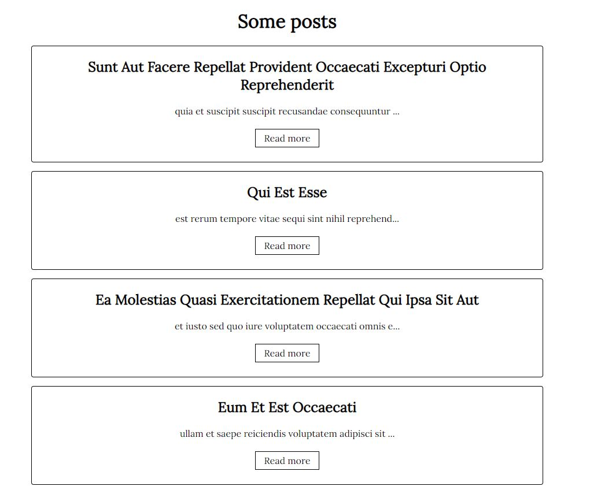

# clean-architecture-posts

clean architecture / hexagonal architecture - FrontEnd

[](https://opensource.org/licenses/Apache-2.0)

### Building project

You must have npm and node.js installed to continue...

```bash
    npm install
```

To run tests

```bash
    npm run test
```

To start Vanilla (Javascript native) app :

```bash
    npm run start:vanilla
```

To start React app :

```bash
    npm run start:react
```

To start Angular app :

```bash
```

To build Vanilla (Javascript native) app for production :

```bash
    npm run build:vanilla
```

To build React app for production :

```bash
    npm run build:react
```

To build Angular app for production :

```bash
```

### Description project

This project was made to show hexagonal architecture power. It's a simple application which
shows some posts...
The user can read a post's details by clicking on a post's button read more...




### Hexagonal architecture

Thanks to the hexagonal architecture, we can focus only in the business logic of the application without knowing 
frameworks, libraries used. Indeed, what matter if it is a REST API or a GRAPHQL API or Cloud API (Firebase, Amazon...), the business logic will stay the same without edit it. The philosophy stays the same with "tools frontal" like Angular, React, VueJS...
If tomorrow, i want to switch React by Angular without change the business logic or
the API layer, i can do it and easily ! This is the power of the hexagonal architecture.
Moreover, thanks to the hexagonal architecture, you can focus easily on TDD and BDD (DDD too, i didn't use it in this project).

Some avantages :

* The business logic is independent

* Maintenance and Evolutions are easy to do

* We can test without to worry about frameworks and infrastructures used

* Dependency inversion used

Some cons :

* Not practical for little application

Hexagonal architecture used by this project : 


### Where can i change adapters around the business logic in the user application ?

* Just change environment variable API to choose graphQL or rest API (API Layer)

* Just run the script from package.json to choose the front application desired (react, vanilla, angular)

### Resources 

https://www.amazon.fr/Clean-Architecture-Robert-Martin-2016-12-10/dp/B01N2GDUQ9

https://blog.cleancoder.com/uncle-bob/2012/08/13/the-clean-architecture.html

https://herbertograca.com/2017/11/16/explicit-architecture-01-ddd-hexagonal-onion-clean-cqrs-how-i-put-it-all-together/ 


